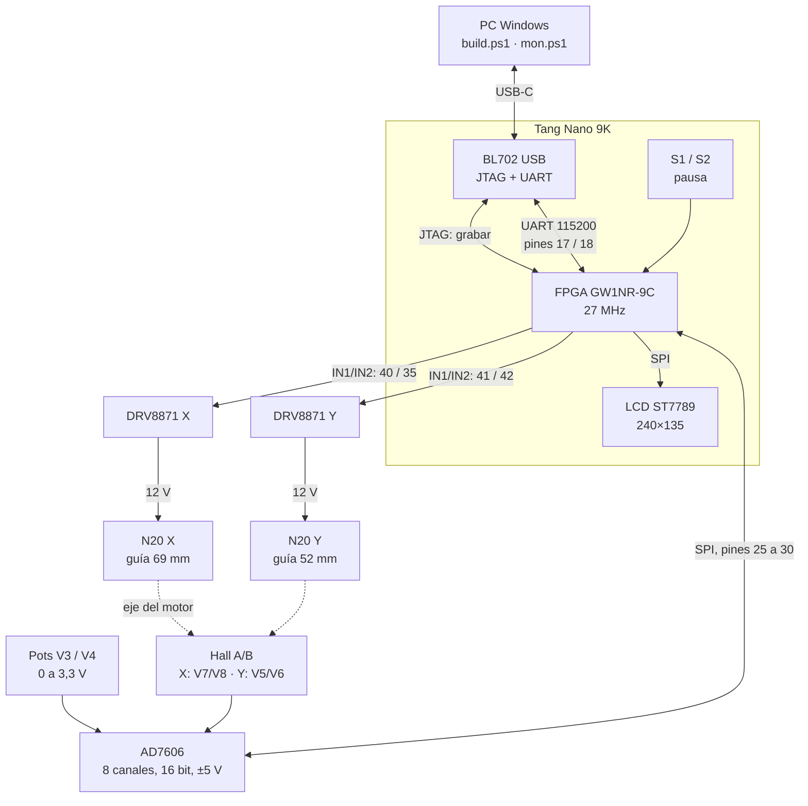
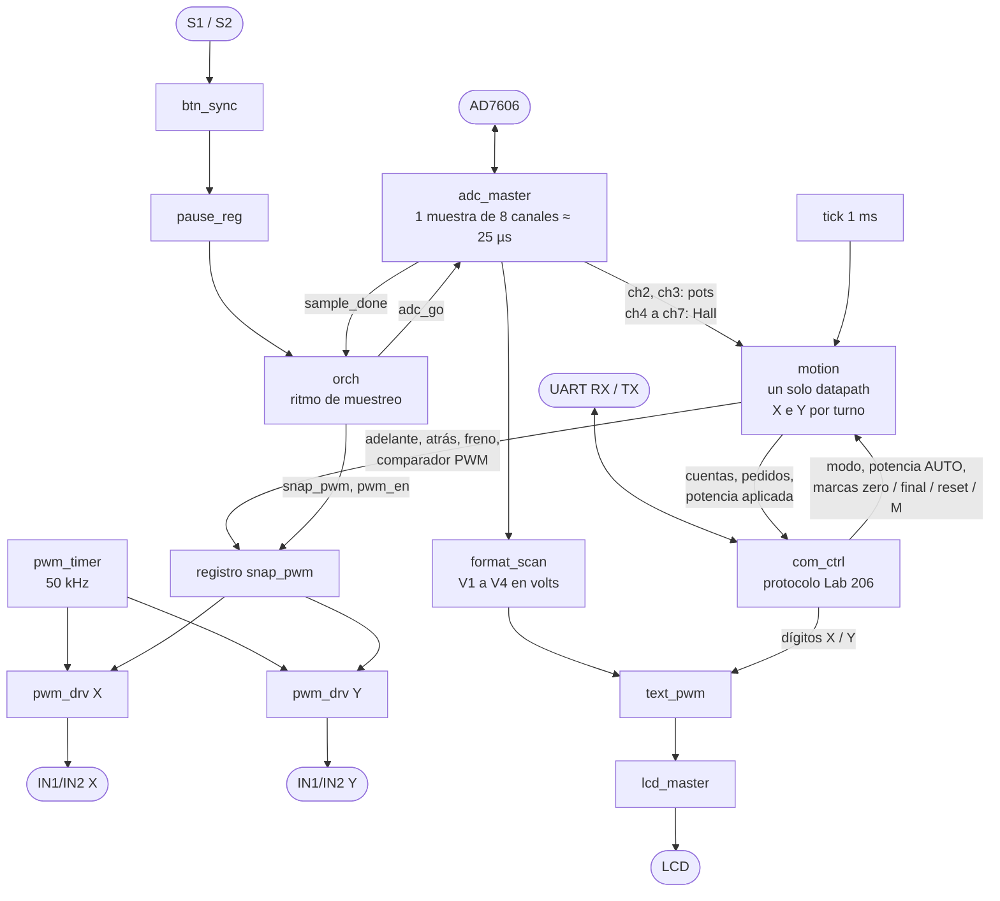
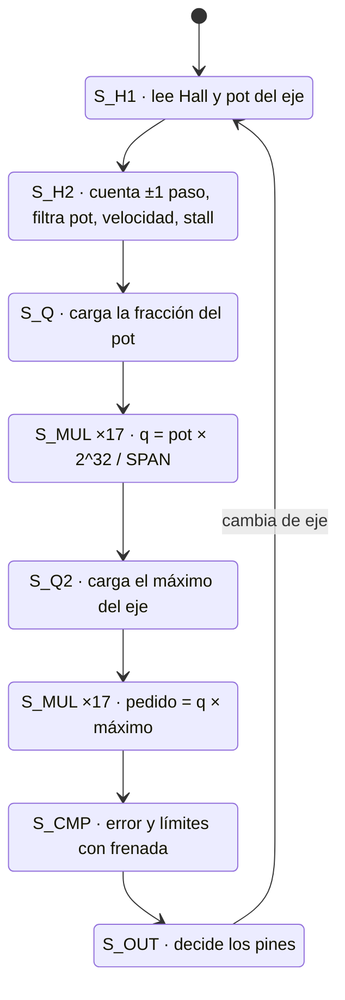
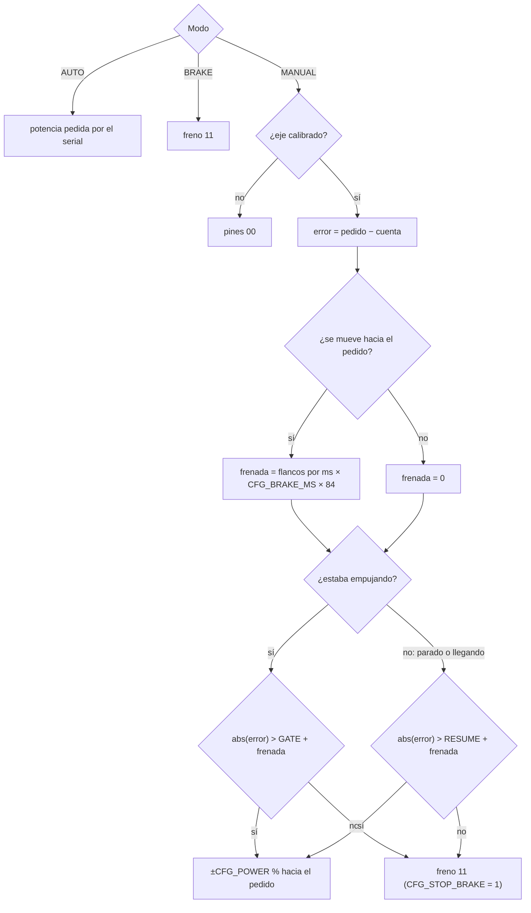
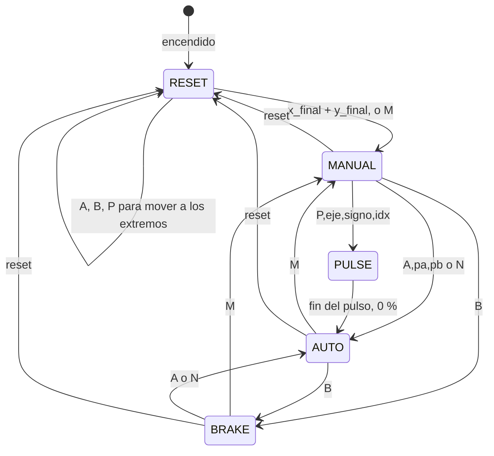
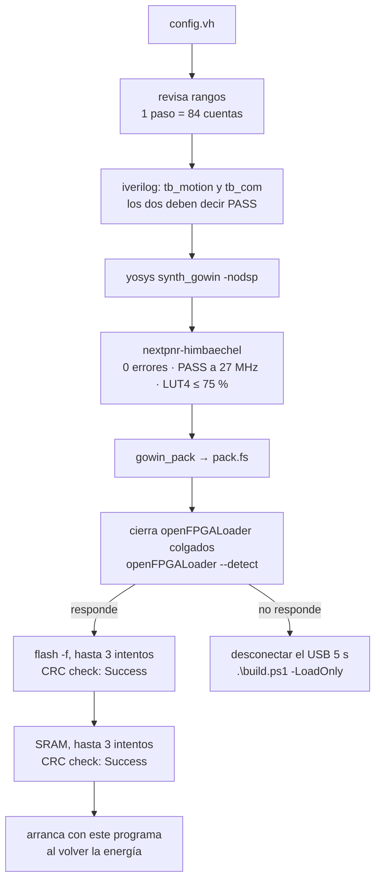

# Motor_CTRL_v2.0

Tang Nano 9K. La FPGA manda los dos DRV8871, lee potenciómetros y encoders Hall por el AD7606, muestra datos en la LCD y habla el protocolo serial de Lab 206.

El potenciómetro pide **un lugar** en la guía, no una velocidad: X recorre 69 mm y Y 52 mm.

Todas las constantes que se ajustan están en **`config.vh`**. Se edita ese archivo y se corre `.\build.ps1`.

---

## Reporte de avance — 2026-09-25 16:15 (UTC-3)

**Estado:** control de posición manual funcionando en la placa. Los dos pots mueven cada eje al lugar pedido y el eje se detiene sin vibrar.

| Qué | Resultado |
| --- | --- |
| Imagen en la placa | Grabada en flash y SRAM el 2026-09-25 15:29, `CRC check: Success` en las dos |
| Simulación | `tb_motion` PASS, `tb_com` PASS |
| Recursos | LUT4 5852 / 8640 (**67 %**), DFF 2282 / 6480 (35 %), sin DSP ni BSRAM |
| Timing | 32,96 MHz, PASS a 27 MHz, 0 errores de nextpnr |
| Potencia | una sola, `CFG_POWER` = 80 % del PWM, igual hacia + y hacia − |
| PWM | 50 kHz (540 ciclos de 27 MHz) |

### Logros de esta entrega

1. **Se eliminó la vibración al llegar** (+80, −80, +80…). Tenía tres causas:
   - La zona de parada (±40 cuentas) era más chica que un flanco del encoder (84 cuentas). Si el pedido caía entre dos flancos, ninguna posición real quedaba dentro y el eje iba y venía para siempre.
   - A 80 % de potencia el motor frenaba recién al entrar en la zona, seguía de largo por inercia y volvía a arrancar al revés.
   - La cuenta sumaba el cambio analógico de los Hall: el ruido del ADC (≥ 39 mV entre dos muestras) sumaba cuentas con el motor quieto.
2. **Conteo exacto del encoder:** cada flanco de cuadratura vale un paso fijo de 84 cuentas. La escala del serial no cambió; el ruido ya no suma.
3. **Zona de parada en pasos del encoder:** `CFG_GATE` = 1 paso, `CFG_RESUME` = 2 pasos. La zona siempre contiene una posición alcanzable.
4. **Frenada anticipada:** mientras va hacia el pedido, frena a una distancia igual a velocidad × `CFG_BRAKE_MS`. Es el principio del control de tiempo mínimo con curva de frenado (PTOS), sin la parte lineal: sigue siendo una sola potencia, sin PID.
5. **Calibración que termina sola:** con `x_final` e `y_final` pasa a `MANUAL`; `M` también la cierra.
6. **`config.vh` ordenado por módulo**, con una sola potencia.
7. **`build.ps1` como único punto de acceso:** simula, sintetiza, coloca, empaqueta y graba flash + SRAM. Cada carga tiene tiempo límite, cierra cargadores colgados y avisa si hay que reconectar el USB.

### Base técnica consultada

- Zona de parada contra resolución del sensor: con una tolerancia menor que un paso del encoder aparecen oscilaciones sostenidas; se recomienda de 1 a 2 pasos. [He, 2006](https://en.cnki.com.cn/Article_en/CJFDTOTAL-DJKZ200603020.htm). La oscilación cerca del objetivo (*hunting*) está descrita en [Armstrong-Hélouvry, Dupont y Canudas de Wit, *Automatica* 30(7), 1994](https://doi.org/10.1016/0005-1098(94)90209-7).
- Potencia máxima lejos y frenado según la velocidad: [Workman, Kosut y Franklin, "Adaptive Proximate Time-Optimal Servomechanisms", ACC 1987 (IEEE)](https://ieeexplore.ieee.org/document/4789386) y [revisión en IEEE Trans. Magnetics 2009](https://doi.org/10.1109/tmag.2009.2013247).
- Frenado con el motor en corto: la distancia de detención es proporcional a la velocidad. [ORMEC TN038](https://www.ormec.com/Portals/ormec/Library/Documents/Controllers/Orion/TechNotes/tn038.pdf), [TI SLVA321](https://www.ti.com/lit/pdf/slva321).
- Velocidad con encoder de baja resolución, contando flancos por ventana: [Petrella et al., IEEE ACEMP 2007](https://doi.org/10.1109/acemp.2007.4510607).
- DRV8871: PWM de 0 a 200 kHz, pulso mínimo de 800 ns (TI SLVSCY9B).

### Próximos pasos

- Ajustar `CFG_BRAKE_MS` en la placa según cómo llega cada eje (ver [Control de posición](#control-de-posición)).
- Las caídas del USB que cortan el serial son de hardware (ver [Problemas conocidos](#problemas-conocidos)): revisar el cable y la tierra de los motores.

---

## Diagramas de arquitectura

### 1. Sistema completo



### 2. Bloques dentro de la FPGA (`top.v`)



Los dos motores usan el mismo circuito de posición (`motion.v`): un contador Hall, un escalador del pot, un multiplicador de un sumador y un comparador. X e Y se turnan en él; cada eje solo conserva sus registros (índice 0 = X, 1 = Y) y sus puertos. Así el diseño no crece con cada eje.

### 3. Ronda de `motion.v` para un eje



Las dos multiplicaciones usan el mismo estado `S_MUL` y el mismo sumador (17 vueltas cada una). Una ronda dura unos 40 ciclos por eje, 80 para los dos: unos 3 µs, mucho menos que los 25 µs entre muestras del ADC.

### 4. Ley de control de cada eje



### 5. Estado del serial



### 6. Compilación y carga (`build.ps1`)



---

## Cómo funciona, paso a paso

Por cada eje, en cada ronda:

1. **Hall:** cada flanco de cuadratura suma o resta **un paso** = `2·CFG_HALL_TH / 2^CFG_HALL_SHIFT` cuentas (84). El sentido lo da la cuadratura. Si en una muestra cambian los dos canales, son dos flancos en el último sentido conocido. El ruido del ADC entre flancos no suma nada. La cuenta nunca baja de 0 y, calibrado el eje, nunca pasa su máximo.
2. **Pot:** promedio de `2^CFG_POT_FILT` muestras (10 ≈ 26 ms). El valor usado cambia solo si el pot se movió más de `CFG_POT_HYST` códigos.
3. **Pedido:** `(pot − CFG_POT_END) / (CFG_POT_FULL − 2·CFG_POT_END) × máximo del eje`, recortado a 0..máximo. Los primeros y últimos `CFG_POT_END` códigos del pot dan 0 y el máximo exactos, aunque el riel no llegue a 3,300 V.
4. **Velocidad:** flancos contados en el último ms, o en el ms en curso si ya son más (así reacciona apenas el motor arranca).
5. **Decisión:** error = pedido − cuenta, y la ley del diagrama 4.

El máximo del eje es el que fijó `x_final`. Antes de eso es la mayor cuenta que alcanzó el encoder desde `x_zero` (o desde el encendido), así que PotA/PotB siempre están en la misma escala que el encoder.

## Control de posición

Hay **una sola potencia**, `CFG_POWER` (% del ciclo PWM), igual hacia + y hacia −.

| Distancia al pedido | Potencia | Pines |
| --- | --- | --- |
| más de `CFG_GATE` + frenada | ±`CFG_POWER` % | PWM hacia el pedido |
| menos | 0 | 11 (freno) si `CFG_STOP_BRAKE = 1`, si no 00 |

`CFG_GATE` y `CFG_RESUME` van en pasos del encoder (1 paso = 84 cuentas). La resolución real es un flanco: una zona de parada más chica que un paso puede caer entre dos flancos, y entonces el eje nunca la alcanza.

**Frenada anticipada.** Con el freno del puente H (motor en corto), la distancia que recorre hasta detenerse crece con la velocidad: ≈ velocidad × una constante de tiempo fija. Por eso, mientras va hacia el pedido, frena a (flancos por ms × `CFG_BRAKE_MS`) pasos antes del borde de la zona.

Una vez detenido (o llegando por inercia), el eje no vuelve a moverse hasta que el error pasa `CFG_RESUME` más esa frenada. Así no tiembla en el borde de la banda.

**Ajuste de `CFG_BRAKE_MS`:**

| Lo que se ve | Qué hacer |
| --- | --- |
| Llega, se pasa y vuelve | subir `CFG_BRAKE_MS` |
| Se detiene antes y avanza a saltitos | bajar `CFG_BRAKE_MS` |

Pasarse hacia arriba es lo seguro: se queda a menos de `CFG_RESUME` pasos del pedido (unos 0,3 mm en X).

El PWM alterna entre avance y freno (slow decay, TI §7.3.1). El serial muestra ese mismo %. `A,pa,pb` se recorta a ±`CFG_POWER` y el pulso `P` usa `CFG_POWER`.

El sentido de cada eje se aprende solo (`CFG_POL_LEARN`). Si el motor empuja `CFG_STALL_MS` sin que el Hall se mueva, se invierte. Después de 15 flancos en el sentido esperado queda confirmado.

Sin `x_final` (o `y_final`, o `M`) ese eje no se mueve y queda en 00. Al encender, Estado es `RESET` hasta calibrar los dos ejes.

## Calibración

La cuenta vale 0 al encender, con `reset` y con `x_zero`, y no baja de 0 en el extremo inferior. Por eso el `final` solo ya calibra el eje.

1. Opcional: `x_zero` en el extremo inferior.
2. Llevar el eje al otro extremo (a mano o con `A,pa,pb`) y mandar `x_final`: esa cuenta es el máximo.
3. Lo mismo con `y_final`.
4. Con los dos `final`, Estado pasa solo de `RESET` a `MANUAL`. El pot a 0 V pide 0, a 3,3 V el máximo y a la mitad la mitad.

`M` (o `MANUAL`) también cierra la calibración: sale de `RESET` y, en un eje sin `final`, toma como máximo la mayor cuenta que alcanzó.

Cada carga del programa y cada corte de energía reinician la FPGA: vuelve a `RESET` y hay que calibrar de nuevo.

## Configuración (`config.vh`)

| Sección | Constantes | Valores hoy |
| --- | --- | --- |
| 1. Placa | `CFG_CLK_HZ` | 27 MHz |
| 2. Drivers DRV8871 | `CFG_PWM_HZ` | 50 kHz |
| 3. Motores | `CFG_POWER`, `CFG_GATE`, `CFG_RESUME`, `CFG_BRAKE_MS`, `CFG_STOP_BRAKE`, `CFG_POL_LEARN`, `CFG_STALL_MS` | 80 %, 1 paso, 2 pasos, 5 ms, freno, aprende, 200 ms |
| 4. Potenciómetros | `CFG_POT_FULL`, `CFG_POT_END`, `CFG_POT_FILT`, `CFG_POT_HYST` | 21626, 200, 10, 4 |
| 5. Encoders Hall | `CFG_HALL_TH`, `CFG_HALL_SHIFT`, `CFG_COUNT_MAX` | 10813 (1,65 V), 8, 999999 |
| 6. Serial | `CFG_BAUD`, `CFG_LINE_HZ`, `CFG_INV_X`, `CFG_INV_Y` | 115200, 50 líneas/s, 0, 0 |
| 7. Guías | `CFG_X_UM`, `CFG_Y_UM` | 69000, 52000 (solo referencia) |

`build.ps1` rechaza valores imposibles antes de compilar: por ejemplo `CFG_GATE` < 1 paso, `CFG_RESUME` ≤ `CFG_GATE`, PWM fuera de rango o `CFG_BRAKE_MS` > 100.

## Pines

| Qué | Dónde |
| --- | --- |
| Reloj 27 MHz | pin 52 |
| ADC SPI | 25–30 (31 es copia de CONVST, sin cable) |
| LCD ST7789 | 47, 48, 49, 76, 77 |
| PWM X IN1 / IN2 | 40 / 35 = J5-13 / 14 |
| PWM Y IN1 / IN2 | 41 / 42 = J5-15 / 16 |
| UART TX | pin 17 → BL702 |
| UART RX | pin 18 ← BL702 |
| Pausa S1 / S2 | pines 3 / 4, PWM a 00 |

Pots 3,3 V: **V3 → X** (ADC ch2), **V4 → Y** (ch3). Hall del motor X: **V7 / V8** (ch6 / ch7). Del motor Y: **V5 / V6** (ch4 / ch5). Hall a 3,3 V. Motores a 12 V. Sin aisladores: la FPGA va directo a IN1/IN2.

PWM: `CFG_PWM_HZ`, hoy 50 kHz (540 ciclos de 27 MHz). El DRV8871 acepta de 0 a 200 kHz con pulsos de al menos 800 ns (SLVSCY9B, §6.3); a 50 kHz eso deja útil del 4 % al 96 %.

## Serial

`CFG_BAUD` 8N1, `CFG_LINE_HZ` líneas por segundo. Cabecera una vez, luego:

```
PotenciaA,PotenciaB,PotA,PotB,Sensor1,Sensor2,Estado,Settled
```

| Campo | Qué es |
| --- | --- |
| PotenciaA / PotenciaB | % aplicado a X / Y, con signo |
| PotA / PotB | cuenta pedida por el pot X / Y, de 0 al máximo de ese eje |
| Sensor1 / Sensor2 | cuenta del encoder X / Y (avanza de a 84 por flanco) |
| Estado | `RESET`, `MANUAL`, `AUTO`, `BRAKE`, `PULSE` |

PotA se compara con Sensor1 y PotB con Sensor2. Con el pot al tope, PotA = máximo de Sensor1.

| Orden | Efecto |
| --- | --- |
| `M` / `MANUAL` | Manual: los pots mandan la posición. Cierra la calibración. |
| `x_zero` / `y_zero` | La cuenta actual de ese eje pasa a 0. |
| `x_final` / `y_final` | La cuenta actual es el máximo de ese eje; el eje queda calibrado. |
| `reset` | Cuentas a 0, borra las marcas y vuelve a `RESET`. |
| `B` | Freno, IN1 = IN2 = 1. |
| `N` | AUTO en 0,0. |
| `A,pa,pb` | AUTO: % con signo para X e Y, recortado a ±`CFG_POWER`. |
| `I,ix,iy` | Invierte el sentido de AUTO. |
| `P,eje,signo,idx` | Pulso de `CFG_POWER` %, 20 × (idx+1) ms. |

Cada orden termina con Enter; sirven CR, LF o CRLF.

Ver la telemetría: `.\mon.ps1 COM11`

## Cómo se graba

Desde `Motor_CTRL_v2.0`:

| Comando | Qué hace |
| --- | --- |
| `.\build.ps1` | Todo: simula, compila y graba flash + SRAM |
| `.\build.ps1 -LoadOnly` | Graba el `pack.fs` ya compilado (se niega si `config.vh` o un `.v` es más nuevo) |
| `.\build.ps1 -Sram` | Compila y carga solo la SRAM (se pierde al apagar) |
| `.\build.ps1 -NoLoad` | Solo compila |
| `.\build.ps1 -NoSim` | Salta las simulaciones |
| `.\build.ps1 -Seed n` | Otra semilla de nextpnr (no es la solución si no cabe) |

En orden, y se detiene en el primer fallo:

1. Lee `config.vh` y revisa los rangos.
2. `iverilog` + `vvp` de `tb_motion.v` (control con motor simulado con inercia) y `tb_com.v` (órdenes por la UART real): los dos tienen que decir `PASS`.
3. `yosys synth_gowin -nodsp` → `top.json` (log en `yosys.log`).
4. `nextpnr-himbaechel`, GW1NR-LV9QN88PC6/I5 a 27 MHz → `pnr.json` (log en `pnr.log`). Exige 0 errores, PASS a 27 MHz y LUT4 ≤ 75 %. Si no cabe, se achica el circuito; otra semilla no es la solución.
5. `gowin_pack` → `pack.fs`.
6. Carga: cierra cualquier `openFPGALoader` que haya quedado suelto, comprueba el programador con `--detect`, graba la flash (`-f`, hasta 3 intentos, 180 s cada uno) y luego la SRAM (hasta 3 intentos, 60 s). Las dos exigen `CRC check: Success`.

## Pruebas

| Banco | Qué prueba | Resultado |
| --- | --- | --- |
| `tb_motion` | Pot → pedido, calibración, polaridad aprendida, ruido del pot, llegada sin vibrar en movimientos largos y empujones de 3 y 4 pasos, una sola potencia, AUTO, BRAKE, reset | PASS |
| `tb_com` | Arranque en RESET, marcas con CRLF, CR o LF, reset, `M` que cierra la calibración | PASS |

El motor simulado tiene inercia: al empujar se acerca a su velocidad máxima (unos 8 flancos por ms) y al frenar en corto pierde velocidad con la misma constante de tiempo (1 ms), como un motor DC. Movimientos de X con distintos `CFG_BRAKE_MS`:

| `CFG_BRAKE_MS` en la simulación | Inversiones de sentido | ¿Queda quieto? |
| --- | --- | --- |
| 0 (sin anticipar) | 2 en el movimiento largo (tope → 1/4) | sí, tras corregir |
| 1 (igual a la constante del motor) | 0 en todos | sí |
| 3 (el triple de lo necesario) | 0 en todos | sí, hasta 1 paso antes del pedido |

`iverilog -DTB_BRAKE_MS=n` cambia ese valor en la simulación; `-DTB_TRACE` imprime cada cambio de pines de X.

## Problemas conocidos

| Síntoma | Causa | Qué hacer |
| --- | --- | --- |
| `build.ps1` dice "el programador USB no responde" | Un `openFPGALoader` cortado a mitad (por ejemplo con Ctrl+C) deja trabado el BL702 | Desconectar el USB 5 s, conectar y `.\build.ps1 -LoadOnly`. No usar Ctrl+C durante la carga |
| La flash da `CRC check : FAIL` al primer intento | Frecuente con este cargador | `build.ps1` reintenta solo (hasta 3) |
| Se corta el serial y desaparece COM11 | Windows registra "dispositivo quitado porque no está en el bus" (evento 1010): el USB se cae por hardware | Probar otro cable directo al PC. Si coincide con los motores, llevar su retorno directo a la fuente de 12 V y poner condensadores en VM y sobre los bornes |

## Archivos

| Archivo | Qué es |
| --- | --- |
| `config.vh` | Todas las constantes |
| `build.ps1` | Simular, compilar y grabar |
| `mon.ps1` | Monitor serial |
| `top.v` | Conexiones de todos los bloques |
| `motion.v` | Datapath de posición compartido por X e Y |
| `com_ctrl.v` | Protocolo serial Lab 206 |
| `adc_master.v`, `orch.v` | Lectura del AD7606 y ritmo |
| `pwm_timer.v`, `pwm_drv.v` | PWM a los DRV8871 |
| `format_scan.v`, `text_pwm.v`, `lcd_master.v` | LCD |
| `btn_sync.v`, `pause_reg.v` | Botón de pausa |
| `board.cst` | Pines |
| `tb_motion.v`, `tb_com.v` | Simulaciones |
| `pack.fs` | Bitstream grabado en la placa |
