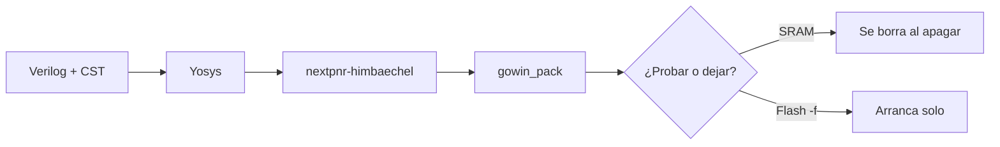

# FPGA Tang Nano 9K — MicroscopIA

Laboratorio en una **Sipeed Tang Nano 9K**: de un LED a un programa que vive en la flash SPI. Cada carpeta es un capítulo. El silicio puede hacer varias cosas a la vez; **estos README no**: se leen de arriba abajo.

**Residente en la placa:** [`adc-pwm/`](adc-pwm/README.md) — 2× DRV8871, ADC, pots V3/V4, PWM directo Table 1. `openFPGALoader -b tangnano9k -f pack.fs`, exigir **CRC check: Success**.

Registro de cierre de este commit: **2026-08-25 16:12 (UTC-4)**. GY-91 visible bajo las líneas del ADC; el usuario confirmó que funciona.

| Capítulo | Carpeta | Pregunta que cierra | Qué ves |
| --- | --- | --- | --- |
| 1 | [`blink/`](blink/README.md) | ¿El bitstream llega al chip? | Un LED parpadea |
| 2 | [`led-seq/`](led-seq/README.md) | ¿Controlamos los seis LED, incluido DONE? | Una luz recorre la fila |
| 3 | [`lcd-grid/`](lcd-grid/README.md) | ¿La LCD de 1.14" muestra una imagen nuestra? | Rejilla turbo que cambia de color |
| 4 | [`lcd-params/`](lcd-params/README.md) | ¿El diseño se explica solo y sobrevive al apagado? | Teleprompter + flash SPI |
| 5 | [`adc-lcd/`](adc-lcd/README.md) | ¿El AD7606 SPI y el GY-91 I2C se ven en la LCD 1″? | V1…V8 + WHO/accel/gyro; **flash SPI** |
| 6 | [`adc-pwm/`](adc-pwm/README.md) | ¿V3/V4 mandan 4 PWM a 2× DRV8871? | **Flash SPI** |
| 7 | [`adc-drv1/`](adc-drv1/README.md) | Un solo puente (ensayo) | Historia |

Las notas de planificación (`Docs/`) **no van en este remoto**. Quedan en el disco local y en `.gitignore`.

---

## 1. La placa, en una frase

Sipeed **Tang Nano 9K**. FPGA Gowin **GW1NR-LV9QN88PC6/I5** (familia efectiva **GW1N(R)-9C**, idcode `0x100481b`). Reloj de usuario: **27 MHz en el pin 52**. Seis LED activos en bajo (pines 10, 11, 13, 14, 15, 16; el 10 comparte DONE). Dos botones activos en bajo (S1 pin 3, S2 pin 4). LCD chica: **ST7789 SPI 240×135** en el conector 8P. El USB-C habla con un **BL702** que hace de JTAG (FT2232, `0403:6010`).

No hace falta el IDE de Gowin para estos capítulos.

---

## 2. Cómo se programa, siempre en este orden

El flujo es el mismo en las cinco apps. Se cuenta como una cadena, no como un menú.

1. **Entorno.** En PowerShell, una sesión: `.\activate-oss-cad.ps1`. Carga la OSS CAD Suite Windows (ruta local `oss-cad-suite/`, no está en este repo). No toca el PATH permanente.
2. **Síntesis (Yosys).** El Verilog se convierte en una red de LUTs y registros Gowin (`synth_gowin` → `top.json`).
3. **Place & route (nextpnr-himbaechel).** Esa red se sienta en el silicio `GW1NR-LV9QN88PC6/I5` con el `.cst` (`--vopt family=GW1N-9C --vopt cst=board.cst`).
4. **Empaquetado (gowin_pack).** Sale `pack.fs`. Casi siempre: `-d GW1N-9C --sspi_as_gpio --mspi_as_gpio`. En `led-seq` se añade `--done_as_gpio` porque se usa el pin 10.
5. **Carga.**
   - **SRAM** (`openFPGALoader -b tangnano9k pack.fs`): prueba. Se borra al apagar.
   - **Flash SPI** (`openFPGALoader -b tangnano9k -f pack.fs`): residente. Al encender, el FPGA lo lee solo. Exigir **CRC check: Success**.

Antes del primer JTAG: Zadig, **WinUSB solo en Interface 0** (JTAG). No tocar Interface 1 / COM (UART). Detect esperado: `GW1N(R)-9C`.

---

## 3. La historia, para una presentación

1. **Blink.** Un contador y un pin. Si el segundo LED respira, el USB, el driver, Yosys, nextpnr y el cargador están vivos.
2. **Secuencia.** El mismo reloj mueve un one-hot por seis salidas. Aparece el pin DONE y la fila física USB→HDMI.
3. **Grilla.** Dejamos los LED como testigo y hablamos SPI con el ST7789. La primera imagen no es un logo: es una tesela de color que demuestra raster, paleta y refresh.
4. **Parámetros.** El diseño se documenta a sí mismo en la LCD. Los botones pausan por **condiciones** (sincronizador + armado al soltar), no por una carrera de temporizadores.
5. **ADC + GY-91.** Un CONVST del AD7606 (FSM que escanea V1…V8) y un maestro I2C del MPU9250 (WHO_AM_I + accel/gyro). LUT4 ~55 %. **Este** es el bitstream en flash desde 2026-08-25 16:08.

Cada README de carpeta desarrolla **un** capítulo: motivación, qué ves, estructura, pines, programación, rebuild.

---

## 4. Convención de este laboratorio

- Un directorio = una aplicación = un `pack.fs`.
- Reloj único de 27 MHz salvo que un README diga lo contrario.
- LED activos en bajo: `0` enciende.
- Programar en SRAM primero; `-f` solo cuando el capítulo pide residir.
- Un bitstream en flash **sustituye** al anterior.
- La carpeta `Docs/` es local; no se publica.

Fecha de esta redacción: 2026-08-25 16:12 (America/New_York, UTC-4). Host: Windows. Remoto: [Nahzap/FPGA_Tang_9K-MicroscopIA](https://github.com/Nahzap/FPGA_Tang_9K-MicroscopIA).
