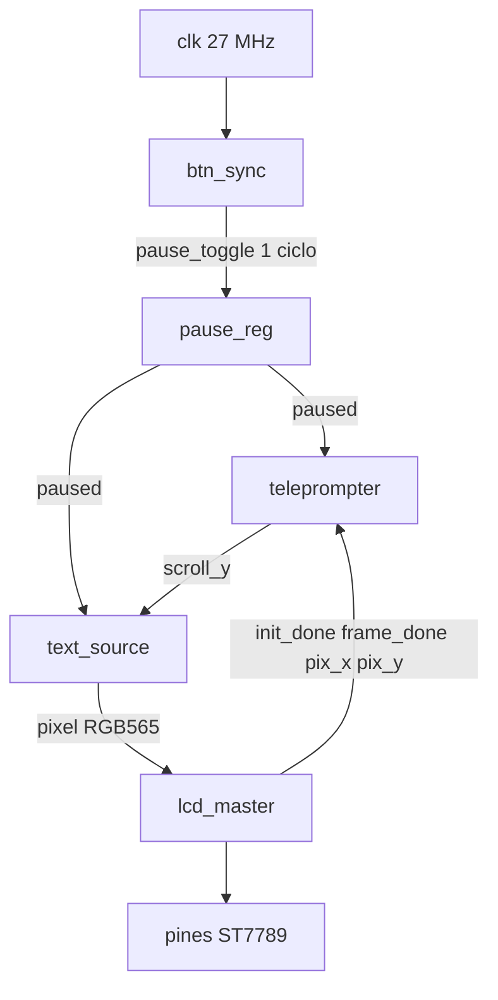

# Teleprompter de parámetros — el diseño se presenta solo

**Capítulo 4 de 5.** Pregunta: ¿puede la placa **decirse** a sí misma, dejarse leer con calma, y **seguir ahí** cuando se corta el USB?

Los capítulos 1–3 probaron JTAG, seis LED y la LCD. Este cierra el laboratorio: una lista que no cabe en 135 px de alto, un scroll tipo teleprompter, dos botones que pausan por **condiciones**, y el bitstream en **flash SPI**.

El HDL puede tener varios módulos en paralelo. **Este README no:** primero se ve, luego se pulsa, luego se entiende el circuito, luego se graba.

---

## 1. Qué deberías ver

Tras el mismo init ST7789 (~0.4 s):

- Arriba, una franja fija: **`RUN`** en amarillo o **`PAUSA`** en rojo. No se va con el scroll.
- Debajo, texto ámbar 8×8 sobre negro. La lista sube un píxel cada 6 fotogramas y, al terminar, vuelve al inicio.
- LED2 (pin 11) encendido en RUN, apagado en PAUSA.

Pulsa **S1 o S2** (cualquiera). El HUD cambia, el texto se congela, la LCD **sigue pintando el mismo cuadro** (no se apaga). Al soltar y pulsar otra vez, reanuda.

Contenido de la lista (ROM + una línea viva):

- Placa: Sipeed Tang Nano 9K
- FPGA: GW1NR-LV9QN88PC6/I5
- Familia: GW1N(R)-9C
- IDCODE: 0x100481B
- Reloj: 27 MHz pin 52
- Flash: persiste al apagar
- LCD: ST7789 240×135 SPI
- PSRAM: 64 Mbit
- LEDs 10 11 13 14 15 16, activo bajo
- Botones pines 3 y 4, activo bajo
- JTAG: BL702 FT2232 USB 0403:6010
- Toolchain: Yosys, nextpnr-himbaechel, gowin_pack
- `Estado: RUN` / `Estado: PAUSA` (no es solo ROM: sigue a `paused`)

Este es el programa que se grabó en flash el 2026-08-15. Al encender sin PC, debería reaparecer. **Sustituido** el 2026-08-25 16:08 por `adc-lcd` (ADC + GY-91).

---

## 2. Por qué “orientado a condiciones”

Un teleprompter mal hecho mezcla tres relojes mentales: “espero 200 ms”, “el SPI a lo mejor ya acabó”, “el botón rebotó”. Eso son **carreras**.

Aquí hay **un** reloj de 27 MHz. Nadie avanza el scroll porque “ya pasó tiempo en abstracto”. El scroll avanza solo si se cumplen **todas** estas condiciones a la vez:

`init_done && frame_done && !paused && line_advance_ok`

- `init_done` — el maestro LCD ya está en STREAM (misma idea que `running` en `lcd-grid`).
- `frame_done` — el raster acaba de emitir el último píxel del 240×135. Lo genera **quien posee el SPI**, no un timer hermano.
- `paused` — el registro de pausa, que solo cambia con un pulso de un ciclo.
- `line_advance_ok` — van 6 `frame_done` seguidos en RUN. Es un divisor del raster, no un segundo dominio.

El botón no usa `always @(posedge clk or posedge btn)` ni un contador de milisegundos como arquitectura. Se sincroniza y se **arma al soltar**.

---

## 3. Estructura — cinco módulos, un dueño del bus

```
lcd-params/
  top.v            Cableado. No tiene FSM propia.
  btn_sync.v       2FF + armado al soltar → pause_toggle
  pause_reg.v      Latch: paused <= ~paused solo con el pulso
  teleprompter.v   scroll_y (0..207), wrap
  text_source.v    ROM de líneas + fuente 8×8 → RGB565
  lcd_master.v     Dueño SPI (init + stream), frame_done
  board.cst
  pack.fs
  README.md
```



Eso es el paralelismo **del programa**. La historia de un pulso, en orden:

1. S1 o S2 baja (activo bajo). Tras dos flip-flops, `any_pressed` es 1.
2. Si `armed` era 1, sale `pause_toggle` un ciclo y `armed` pasa a 0.
3. `pause_reg` invierte `paused`.
4. Mientras el botón siga abajo, no hay más pulsos.
5. Al soltar, `armed` vuelve a 1. El siguiente gesto (el mismo u el otro botón) es el único que cuenta.

`text_source` es combinacional respecto al píxel: con `(pix_x, pix_y, scroll_y, paused)` decide HUD vs cuerpo, carácter, fila de glifo y color. El HUD usa las primeras 16 filas de pantalla y **ignora** `scroll_y`. El cuerpo lee la ROM como si el mundo vertical empezara en `pix_y + scroll_y`.

`lcd_master` es el hermano de `lcd_st7789` del capítulo 3: mismos estados RESET → PREPARE → WAKE → SNOOZE → INIT → STREAM, misma ROM de 70 palabras, mismos offsets 40/53. En STREAM, cuando termina el último píxel, levanta `frame_done` un ciclo. Nadie más toca `lcd_cs`.

---

## 4. Pines

| Señal | Pin | Nota |
| --- | --- | --- |
| `clk` | 52 | 27 MHz |
| `btn0_n` | 3 | S1, activo bajo, pull-up, LVCMOS33 |
| `btn1_n` | 4 | S2, activo bajo, pull-up. También **JTAGSEL_N**: no lo mantengas pulsado al arrancar si quieres JTAG |
| `lcd_clk` | 76 | SCL |
| `lcd_data` | 77 | MOSI |
| `lcd_cs` | 48 | |
| `lcd_rs` | 49 | DC |
| `lcd_resetn` | 47 | |
| `led` | 11 | LED2: `assign led = paused` (activo bajo → encendido en RUN) |

Botones: `amaranth_boards/tang_nano_9k.py` (`ButtonResources(pins="3 4", invert=True)`) y seda Sipeed. LVCMOS33 (no LVCMOS18) para convivir con el banco de los LED.

LCD: mismo CST que `lcd-grid` / ejemplo Sipeed `spi_lcd`. Cable 8P en el sentido de la seda.

---

## 5. Cómo se programa (secuencia)

Primero **probar** en SRAM. Después, si el teleprompter se lee bien, **dejarlo** en flash. Un `-f` nuevo sustituye al residente anterior.

```powershell
cd D:\FPGA
.\activate-oss-cad.ps1
cd D:\FPGA\lcd-params

yosys -p "read_verilog top.v btn_sync.v pause_reg.v teleprompter.v text_source.v lcd_master.v; synth_gowin -top top -json top.json"

nextpnr-himbaechel --json top.json --write pnr.json --device GW1NR-LV9QN88PC6/I5 --vopt family=GW1N-9C --vopt cst=board.cst

gowin_pack -d GW1N-9C --sspi_as_gpio --mspi_as_gpio -o pack.fs pnr.json

openFPGALoader -b tangnano9k pack.fs
```

Cuando la LCD y los botones estén bien:

```powershell
openFPGALoader -b tangnano9k -f pack.fs
```

Esperado en flash: `write to flash`, borrado, escritura 100 %, `CRC check: Success`.

| Destino | Comando | Al apagar |
| --- | --- | --- |
| SRAM | sin `-f` | Se borra. Iterar aquí. |
| Flash SPI | `-f` | Queda. El FPGA lo carga al encender. |

No uses S2 (pin 4) apretado durante el power-on si vas a volver a programar por JTAG.

---

## 6. Cómo se presenta este capítulo

1. Enciende la placa **sin** el PC: el texto ya está (flash).
2. Deja que suba. Señala el HUD `RUN`.
3. Pulsa un botón. Señala `PAUSA` y que la imagen no se apaga.
4. Explica una frase: *el scroll no tiene reloj propio; pide permiso al último píxel*.
5. Si hace falta el detalle de toolchain, vuelve al [índice](../README.md) y al checklist.

`blink`, `led-seq` y `lcd-grid` no se modifican al reconstruir este proyecto. Son capítulos anteriores, no dependencias de compilación.

---

## 7. Límites

- Fuente 8×8, ~16 caracteres por línea: los nombres largos van partidos en dos renglones de ROM.
- Offsets 40/53: mismo riesgo de desplazamiento que en `lcd-grid`.
- No hay GAO ni UART de debug en este bitstream.
- La PSRAM de 64 Mbit se **nombra** en la lista; este diseño no la usa.

Volver al índice: [`../README.md`](../README.md).

**Registro 2026-08-25 16:12 (America/New_York, UTC-4).** Ya no es el residente. Flash actual: `adc-lcd`, CRC Success 16:08.
